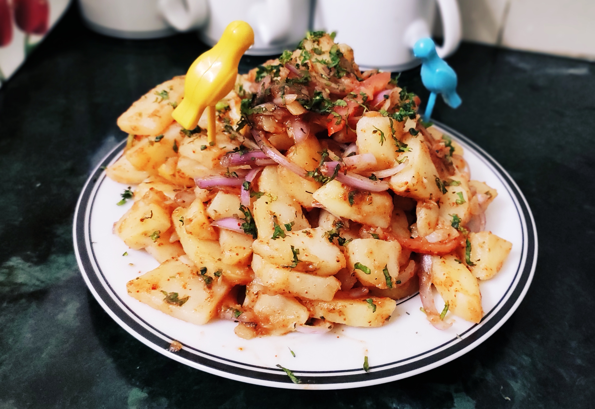

# This dish can be cooked up in just **4 easy steps**!!

Step 1 : Chop the boiled and peeled potatoes into **medium** sized dices

Step 2 : Uniformly mix all the masalas and the tamarind paste with the chopped potatoes

Step 3 : Mix in The Bhujia and Chopped Onions too..

Step 4 : Finally add salt to taste, corn/whole chana as per wish and top it of with some graded cheese!!

Thats it!! Now you can enjoy this *Aloo Kabuli* as a appetizer or in Pav!! 
  
